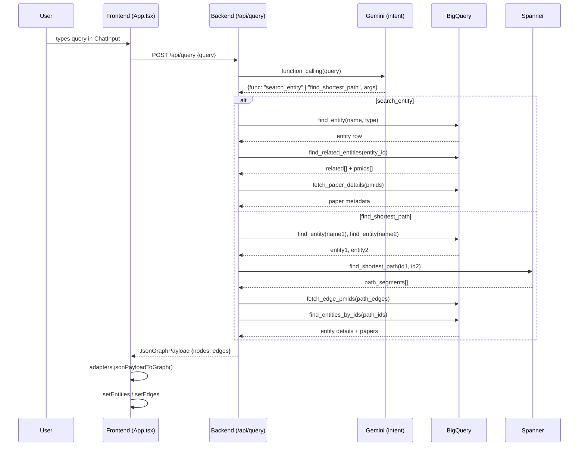
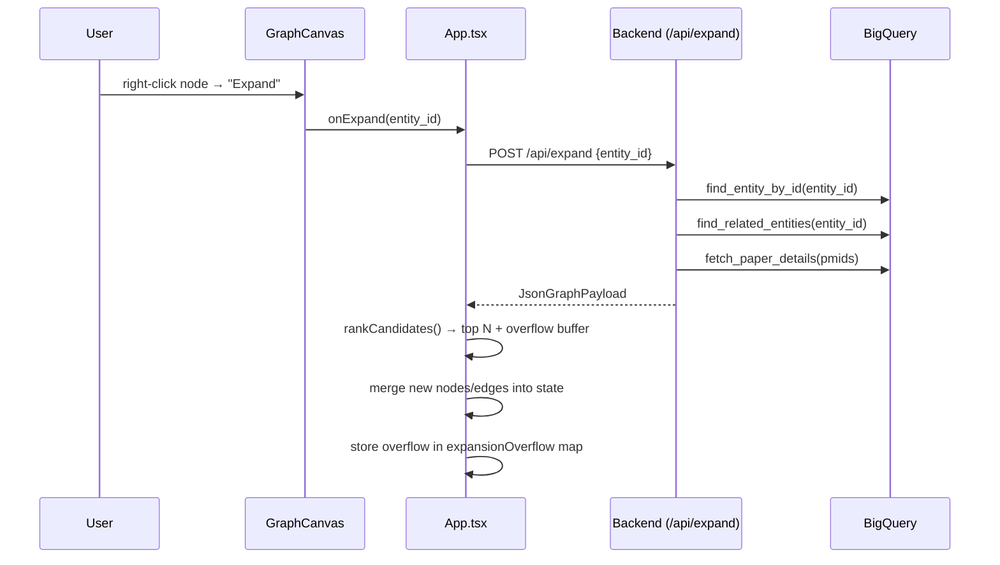
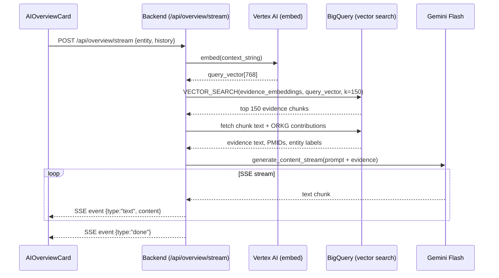
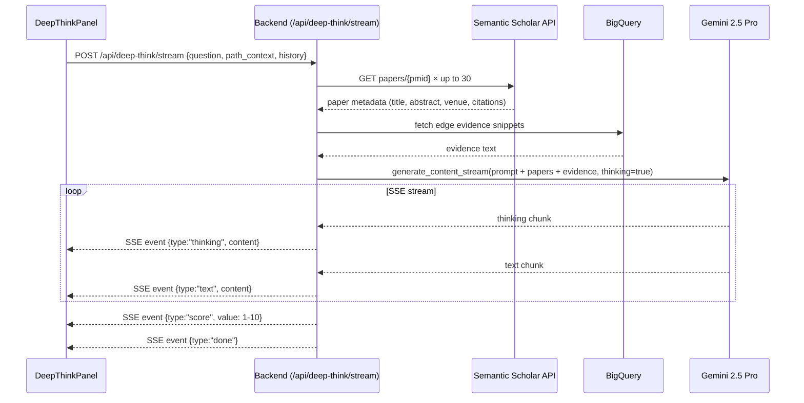
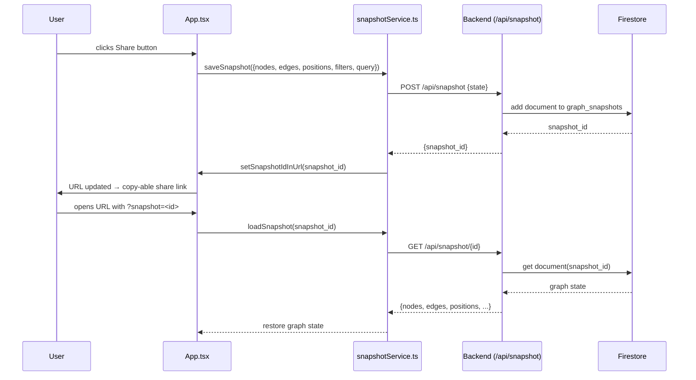

# Architecture — MultihopWanderer (BioRender)

> Technical reference for the multi-hop biomedical knowledge graph explorer
> built for BenchSci Google Cloud Hackathon, Challenge #5.

---

## A. Module Map

```
benchsci-googlecloud-hackathon/
├── frontend/                        # React 19 + Vite 7 SPA
│   ├── src/
│   │   ├── App.tsx                  # Root component — all global state (1100+ lines)
│   │   ├── App.css                  # Global layout styles
│   │   ├── main.tsx                 # Vite entry point
│   │   ├── components/
│   │   │   ├── GraphCanvas.tsx      # Three.js + d3-force WebGL graph renderer
│   │   │   ├── AIOverviewCard.tsx   # Left-pane RAG summary (SSE consumer)
│   │   │   ├── DeepThinkPanel.tsx   # Right-pane extended reasoning chat (SSE)
│   │   │   ├── PathwayPanel.tsx     # Shortest-path result display (edges + evidence)
│   │   │   ├── EvidencePanel.tsx    # Edge citation details (PubMed snippets)
│   │   │   ├── SearchBar.tsx        # Fuzzy entity search with debounce
│   │   │   ├── EntityCard.tsx       # Selection history card (left sidebar)
│   │   │   ├── EntityFilter.tsx     # Entity type multi-select dropdown
│   │   │   ├── ChatInput.tsx        # DeepThink chat input
│   │   │   ├── Toolbar.tsx          # Fit-to-view, reset, share, filter controls
│   │   │   ├── PathBreadcrumb.tsx   # Graph traversal breadcrumb trail
│   │   │   ├── GraphLegend.tsx      # Node type color/shape legend
│   │   │   ├── ProvenanceBadge.tsx  # Curated/Literature/Inferred badge
│   │   │   └── EntityAdvancedSearchPanel.tsx  # Candidate expansion suggestions
│   │   ├── data/
│   │   │   ├── dataService.ts       # queryEntity / expandEntity API calls
│   │   │   ├── adapters.ts          # Backend JSON → frontend Entity/GraphEdge types
│   │   │   ├── snapshotService.ts   # Save/load graph state (Firestore + localStorage)
│   │   │   ├── entityResearch.ts    # Paper enrichment lookups
│   │   │   └── mockData.ts          # Offline dev fixture
│   │   ├── types/
│   │   │   ├── index.ts             # Entity, GraphEdge, EvidenceItem domain types
│   │   │   └── api.ts               # API request/response payload types
│   │   └── utils/
│   │       ├── rankCandidates.ts    # Multi-signal candidate scoring + ranking
│   │       ├── urlState.ts          # Encode/decode snapshot ID in URL params
│   │       └── exports.ts           # Graph export helpers
│   ├── public/data_model.json       # Seed graph (BRCA1 demo, offline fallback)
│   ├── Dockerfile                   # Node 20 Alpine + serve
│   ├── vite.config.ts
│   └── package.json
│
├── backend/                         # FastAPI Python 3.11
│   ├── main.py                      # FastAPI app, CORS middleware, router mount
│   ├── config.py                    # Pydantic Settings (env var → typed config)
│   ├── routers/
│   │   ├── query.py                 # All API routes: /query, /expand, /overview/*, /deep-think/*
│   │   └── snapshot.py              # /snapshot CRUD routes
│   ├── services/
│   │   ├── bigquery.py              # Entity lookups, relationship queries, evidence fetch
│   │   ├── spanner.py               # Cloud Spanner GQL client wrapper
│   │   ├── pathfinder.py            # Bidirectional BFS shortest-path via Spanner Graph
│   │   ├── gemini.py                # Entity extraction, intent detection (function calling)
│   │   ├── overview.py              # RAG pipeline: embed → retrieve → generate (SSE)
│   │   ├── deep_think.py            # Extended reasoning pipeline (SSE, multi-turn)
│   │   ├── graph_builder.py         # Assemble JsonGraphPayload from raw data
│   │   ├── orkg_context.py          # ORKG enrichment queries (BigQuery)
│   │   └── snapshot_store.py        # Firestore read/write for graph snapshots
│   ├── models/
│   │   ├── request.py               # QueryRequest, ExpandRequest
│   │   ├── response.py              # JsonGraphPayload, Node, Edge schemas
│   │   ├── overview.py              # OverviewStreamRequest
│   │   └── deep_think.py            # DeepThinkRequest, DeepThinkChatRequest
│   └── Dockerfile                   # Python 3.11 Slim
│
├── scripts/gcp/                     # Data pipeline and deployment scripts
│   ├── download-pkg-dataset-to-gsb.sh
│   ├── convert_tsv_to_parquet.py
│   ├── load_sql_to_bigquery.sh
│   ├── load_spanner_graph.py
│   ├── load_orkg_to_bigquery.sh
│   ├── verify_overview_vector.py
│   ├── deploy_frontend_cloud_run.sh
│   ├── deploy_backend_cloud_run.sh
│   └── switch-config.sh
│
├── notebooks/                       # Data exploration (Jupyter)
├── data/                            # Local data artifacts (gitignored large files)
├── archive/                         # Stale planning docs + early prototypes
│
├── cloudbuild.frontend.yaml         # Frontend Cloud Build CI/CD
├── cloudbuild.backend.yaml          # Backend Cloud Build CI/CD
├── cloudbuild.yaml                  # Combined trigger (monorepo)
├── ARCHITECTURE.md                  # This file
├── README.md                        # Product overview
├── LICENSE                          # MIT — Team MultihopWanderer
├── NOTICE                           # Third-party license attributions
└── CLAUDE.md                        # Developer guide (AI assistant instructions)
```

---

## B. Frontend Architecture

### Component Tree

```
App (global state)
├── [left pane]
│   ├── ChatInput          — search query input
│   ├── EntityFilter       — entity type filter chips
│   ├── Toolbar            — fit/reset/share/filter actions
│   ├── EntityCard[]       — selection history cards
│   └── AIOverviewCard     — RAG summary (SSE stream consumer)
│
├── [center canvas]
│   ├── GraphCanvas        — Three.js WebGL renderer + d3-force layout
│   │   └── PathBreadcrumb — overlaid traversal breadcrumb
│   └── GraphLegend        — overlaid color/shape legend
│
└── [right pane]
    ├── EntityAdvancedSearchPanel  — expansion candidate list + Load More
    ├── EvidencePanel              — edge citation details
    ├── PathwayPanel               — shortest-path edge list
    └── DeepThinkPanel             — extended reasoning chat (SSE stream consumer)
```

### State Management

All state lives in `App.tsx` (React Hooks, no Redux/Zustand). Key state slices:

| State | Type | Purpose |
|---|---|---|
| `entities` | `Entity[]` | All nodes currently in graph |
| `edges` | `GraphEdge[]` | All edges currently in graph |
| `selectedEntity` | `Entity \| null` | Currently focused node |
| `selectedEdge` | `GraphEdge \| null` | Currently focused edge |
| `selectionHistory` | `Entity[]` | Ordered history for overview context |
| `expansionSnapshots` | `Map<id, {entityIds, edgeIds}>` | Tracks which nodes came from which expansion (for undo) |
| `expansionOverflow` | `Map<id, {entities, edges}>` | Candidate overflow buffer for "Load More" |
| `pathNodeIds` | `string[]` | Ordered node IDs for shortest-path display |
| `centerNodeId` | `string` | Focal node for PathwayPanel |
| `overviewHistory` | `{selectionKey, selectionType, summary}[]` | Last N overview summaries (RAG context window) |
| `activeRightSection` | `'overview' \| 'search' \| 'deepthink'` | Right pane tab selection |

### Data Flow (Search → Graph)

```
User types in ChatInput
    → debounced call to dataService.queryEntity()
        → POST /api/query
        → Backend: intent detection (Gemini function calling)
        → Backend: entity lookup (BigQuery) OR shortest path (Spanner)
        → returns JsonGraphPayload
    → adapters.jsonPayloadToGraph() converts to Entity[] + GraphEdge[]
    → setEntities / setEdges updates state
    → GraphCanvas re-renders with new nodes + edges
    → AIOverviewCard triggers new SSE stream for selected entity
```

### Three.js + d3-force Rendering Pipeline

`GraphCanvas.tsx` manages:
1. **Scene setup** — Three.js `WebGLRenderer`, `PerspectiveCamera`, `Scene`
2. **Node geometry** — five entity shapes built with `THREE.Shape` / `THREE.TorusGeometry` / `THREE.CylinderGeometry`; each color-coded
3. **Edge rendering** — `THREE.Line` with `LineBasicMaterial`, glow via additive blending
4. **Physics layout** — `d3-forceSimulation` with `forceManyBody`, `forceLink`, `forceCenter`, `forceCollide`; tick updates `Object3D` positions
5. **Interaction** — `THREE.Raycaster` for click/hover hit detection; selection rings as `THREE.RingGeometry` children
6. **Animation loop** — `requestAnimationFrame` drives simulation ticks and camera controls

### Candidate Ranking (`utils/rankCandidates.ts`)

Five-signal composite score for expansion candidate ordering:

| Signal | Weight | Source |
|---|---|---|
| Confidence | 35% | Mean edge score + log(edge count) |
| Evidence | 25% | Supporting paper count per edge |
| Provenance | 15% | curated > literature > inferred |
| Publication metrics | 15% | papers + 3× trials + 2× patents |
| Co-occurrence | 10% | Max co-occurrence signal |

After scoring, diversity selection ensures one representative per entity type before filling remaining slots by score.

---

## C. Backend Architecture

### Router → Service → GCP Chain

```
POST /api/query
  → gemini.extract_query_intent()       [Vertex AI — function calling]
  → find_entity()                        [BigQuery: entity name lookup]
  → find_related_entities()              [BigQuery: edge + evidence fetch]
  → fetch_paper_details()                [BigQuery: PMID details]
  → graph_builder.build_graph_payload()  [assemble response]

POST /api/query (shortest path branch)
  → gemini.extract_query_intent()        [Vertex AI — function calling]
  → find_entity() × 2                   [BigQuery: both endpoint lookups]
  → pathfinder.find_shortest_path()      [Cloud Spanner Graph: GQL + BFS]
  → fetch_edge_pmids()                   [BigQuery: enrich path edges]
  → find_entities_by_ids()              [BigQuery: batch entity details]
  → graph_builder.build_path_graph_payload()

POST /api/expand
  → find_entity_by_id()                  [BigQuery]
  → find_related_entities()              [BigQuery]
  → fetch_paper_details()                [BigQuery]
  → graph_builder.build_graph_payload()

POST /api/overview/stream  (SSE)
  → overview.stream_overview_events()
      → embed query                      [Vertex AI Embeddings]
      → vector similarity search         [BigQuery vector index]
      → retrieve top-K evidence chunks   [BigQuery]
      → orkg_context.fetch_orkg()        [BigQuery: ORKG table]
      → Gemini generate (streaming)      [google-generativeai SDK]
      → yield SSE text/citation events

POST /api/deep-think/stream  (SSE)
  → deep_think.stream_deep_think_events()
      → fetch paper metadata             [Semantic Scholar REST API]
      → fetch edge evidence              [BigQuery]
      → Gemini 2.5 Pro thinking stream   [google-generativeai SDK]
      → yield SSE thinking/text/score events

POST /api/deep-think/chat/stream  (SSE)
  → deep_think.stream_deep_think_chat_events()
      → same as above, multi-turn context appended

POST /api/snapshot   (CRUD)
  → snapshot_store.save/load             [Firestore: graph_snapshots collection]
```

### Streaming Pattern

All AI endpoints return `StreamingResponse` with `media_type="text/event-stream"`. The frontend uses the `EventSource`-compatible `fetch` + `ReadableStream` pattern to consume SSE events. Each event carries a `type` field (`text`, `citation`, `thinking`, `score`, `error`, `done`).

---

## D. GCP Service Details

### BigQuery (`benchspark-data-1771447466.kg_raw`)

Primary read-only data warehouse. Key tables:

| Table | Content | Primary Use |
|---|---|---|
| `entities` | Biomedical entities with type, name, synonyms, ID | Entity search, lookup by ID |
| `relationships` | Entity pairs with relation type, confidence, provenance, co-occurrence | Graph edge construction |
| `evidence` | PMID linkages per relationship, source text snippets | Evidence panel, RAG retrieval |
| `papers` | PubMed paper metadata (title, year, abstract) | Evidence display, paper enrichment |
| `trials` | Clinical trial records linked to entities | Publication metric scoring |
| `patents` | Patent records linked to entities | Publication metric scoring |

Vector search tables (workspace project `multihopwanderer-1771992134.multihopwanderer`):

| Table | Content |
|---|---|
| `evidence_embeddings_pilot` | Gemini embedding vectors for evidence chunks |
| `evidence_doc_entities_pilot` | Entity-to-evidence-document index |
| `orkg_contributions` | ORKG contribution records for evidence enrichment |

### Cloud Spanner (`benchspark-graph` / `biograph`)

Graph database for shortest-path queries. Schema mirrors the BigQuery entity/relationship structure but is optimized for GQL traversal.

- **Query pattern**: bidirectional BFS via GQL `GRAPH biograph MATCH` with path length limit (~4 hops per direction, ~8 hops total)
- **Returns**: ordered list of `{from, to, relation_type}` path segments
- **PMIDs**: fetched separately from BigQuery post-traversal (Spanner stores structure, not evidence text)

### Firestore (`multihopwanderer-1771992134` / `graph_snapshots`)

Document store for graph state persistence.

- **Document structure**: `{query, nodes, edges, positions, filters, expansionHistory, timestamp}`
- **Snapshot ID**: Firestore auto-generated document ID, encoded in URL param `?snapshot=<id>`
- **Fallback**: if Firestore is unavailable, the frontend falls back to `localStorage`

### Vertex AI (Embeddings)

- **Model**: `gemini-embedding-001` (primary), `text-embedding-005` (fallback)
- **Usage**: embed the user's selection context (entity name + selection history) for RAG similarity search
- **Vector index**: stored in BigQuery `evidence_embeddings_pilot` table; queried with `VECTOR_SEARCH()`

### Google GenAI — Gemini Models

| Model | Use | Config Key |
|---|---|---|
| `gemini-3-flash-preview` | AI Overview generation, intent detection | `GEMINI_OVERVIEW_MODEL` |
| `gemini-2.5-flash` | Overview fallback | `GEMINI_OVERVIEW_MODEL_FALLBACKS` |
| `gemini-2.0-flash` | Overview second fallback | `GEMINI_OVERVIEW_MODEL_FALLBACKS` |
| `gemini-2.5-pro` | DeepThink extended reasoning | `GEMINI_DEEP_THINK_MODEL` |

---

## E. Data Sources

### PKG 2.0 (Pharmaceutical Knowledge Graph)

12 BigQuery tables sourced from SciDB. Coverage:

| Category | Details |
|---|---|
| Entities | Genes, diseases, drugs, proteins, pathways (NCBI, UMLS, ChEMBL, UniProt, Reactome IDs) |
| Relationships | ~12M curated + literature-mined edges |
| Paper links | ~482M paper-entity associations |
| Evidence | PubMed abstracts, MeSH terms, co-occurrence scores |
| Clinical | Trial records linked to entities |
| IP | Patent records linked to entities |

### ORKG (Open Research Knowledge Graph)

Loaded into BigQuery (`orkg_contributions` table). Provides structured research contributions for evidence enrichment in the RAG pipeline. Queried when generating AI Overviews to add ORKG-sourced supporting evidence.

### Semantic Scholar

REST API called at DeepThink time to enrich paper context. Up to 30 papers fetched per DeepThink query. Returns: title, abstract, venue, year, citation count, authors.

---

## F. AI/ML Pipeline

### RAG Pipeline (AI Overview)

```
1. User selects entity or edge
2. Build context string: entity name + last N selection summaries
3. Embed context → Vertex AI (gemini-embedding-001) → 768-dim vector
4. VECTOR_SEARCH(evidence_embeddings_pilot, query_vector, top_k=150)
5. Re-rank top 150 → select top 20 by cosine similarity
6. Fetch evidence chunks from BigQuery (text snippets, PMIDs, entity labels)
7. Fetch ORKG contributions for entity
8. Assemble system prompt with retrieved chunks + citation index [1..N]
9. Stream Gemini 3 Flash generate() → yield SSE text events
10. Inline [N] citation markers → frontend renders as clickable references
```

**Model cascade**: if the primary model returns an error, the backend iterates through `GEMINI_OVERVIEW_MODEL_FALLBACKS` (comma-separated model IDs).

### Gemini Intent Detection

```
1. User submits query string
2. POST /api/query with raw text
3. Gemini function-calling with two declared tools:
   - search_entity(entity_name, entity_type?)
   - find_shortest_path(entity1_name, entity1_type?, entity2_name, entity2_type?)
4. Gemini returns function call + extracted arguments
5. Backend dispatches to _handle_search_entity() or _handle_shortest_path()
6. Fallback: if function calling fails, single-entity extraction via extract_entity()
```

### DeepThink Reasoning Flow

```
1. User submits question in DeepThinkPanel
2. Backend fetches:
   a. Path context (nodes + edges from current graph state, passed in request)
   b. Paper metadata for relevant PMIDs (Semantic Scholar API, up to 30)
   c. Edge evidence snippets (BigQuery)
3. Assemble enriched system prompt with full path context + paper abstracts
4. Gemini 2.5 Pro with extended thinking budget:
   - thinking_config = {"thinking_budget": large}
   - stream generate_content_stream()
5. SSE events emitted per chunk:
   - type="thinking" — reasoning trace (displayed in collapsed section)
   - type="text"    — final answer tokens
   - type="score"   — confidence 1–10 extracted from model output
   - type="done"    — stream complete
6. Multi-turn: prior turns appended as conversation history in subsequent requests
```

---

## G. Data Flow Diagrams

### Query Flow



### Expand Flow



### AI Overview Stream Flow



### DeepThink Stream Flow



### Snapshot Flow



---

## H. Key Configuration

All settings are in `backend/config.py` (Pydantic Settings). Values are read from environment variables or `.env` file at startup.

| Variable | Default | Purpose |
|---|---|---|
| `GCP_PROJECT_ID` | `multihopwanderer-1771992134` | Workspace GCP project (AI, Spanner, Firestore) |
| `GCP_REGION` | `us-central1` | Default region for GCP services |
| `GEMINI_ENDPOINT_URL` | `""` | Entity extraction Cloud Run endpoint — **must be set via env var** |
| `GEMINI_API_KEY` | `""` | Google GenAI API key (set in Secret Manager) |
| `GEMINI_APP_KEY` | `""` | Alternative GenAI key |
| `GOOGLE_CLOUD_API_KEY` | `""` | Google Cloud API key |
| `GEMINI_OVERVIEW_MODEL` | `gemini-3-flash-preview` | Primary model for AI overviews |
| `GEMINI_OVERVIEW_MODEL_FALLBACKS` | `""` | Comma-separated fallback models |
| `GEMINI_DEEP_THINK_MODEL` | `gemini-2.5-pro` | Model for DeepThink extended reasoning |
| `GEMINI_OVERVIEW_LOCATION` | `global` | Vertex AI location for overview model |
| `BQ_DATASET` | `kg_raw` | BigQuery dataset name (data project) |
| `OVERVIEW_RAG_DATASET` | `multihopwanderer` | BigQuery dataset for RAG tables (workspace project) |
| `OVERVIEW_RAG_EMBED_TABLE` | `evidence_embeddings_pilot` | Embedding vectors table |
| `OVERVIEW_RAG_ENTITY_TABLE` | `evidence_doc_entities_pilot` | Entity-to-doc index table |
| `OVERVIEW_EMBEDDING_MODEL` | `gemini-embedding-001` | Embedding model |
| `OVERVIEW_HISTORY_LIMIT` | `3` | Number of past selections included in RAG context |
| `OVERVIEW_RAG_TOP_K` | `20` | Final top-K evidence chunks for RAG |
| `OVERVIEW_RAG_FETCH_K` | `150` | Candidate pool size before re-ranking |
| `MAX_RELATED_ENTITIES` | `50` | Max neighbors returned per expand |
| `MAX_EVIDENCE_PER_EDGE` | `5` | Max evidence items per graph edge |
| `SPANNER_INSTANCE_ID` | `benchspark-graph` | Spanner instance |
| `SPANNER_DATABASE_ID` | `biograph` | Spanner database |
| `FIRESTORE_COLLECTION` | `graph_snapshots` | Firestore collection for snapshots |
| `SEMANTIC_SCHOLAR_API_KEY` | `""` | Semantic Scholar API key (optional, higher rate limits) |
| `CORS_ORIGINS` | `[localhost:5173, ...]` | Allowed CORS origins |
| `ORKG_ENABLED` | `true` | Toggle ORKG evidence enrichment |
| `ORKG_MAX_RESULTS` | `10` | Max ORKG contributions per entity |
| `SERVICE_ACCOUNT_KEY_PATH` | `service-account-key.json` | Path to GCP service account key file (never commit) |

### Frontend Environment (Vite)

Frontend reads `VITE_API_BASE_URL` at build time (set to the deployed backend Cloud Run URL). Falls back to relative paths for local development.
