# BioRender

> An interactive biomedical knowledge graph explorer — built for the **BenchSci Google Cloud Hackathon** (Challenge #5: "From Wandering to Wisdom").

BioRender enables researchers to search for biomedical entities (genes, diseases, drugs, pathways, proteins), explore their graph neighborhoods through force-directed 3D visualization, discover multi-hop connections, and inspect AI-powered summaries backed by PubMed evidence.

---

## Application Flow

```mermaid
flowchart TB
    subgraph User["User Interface (React + Three.js)"]
        Search["Search Bar\n(fuzzy entity search)"]
        Graph["3D Graph Canvas\n(Three.js + d3-force)"]
        Evidence["Evidence Panel\n(PubMed citations)"]
        DeepThink["DeepThink Panel\n(extended reasoning)"]
        Overview["AI Overview\n(RAG summaries)"]
        PathPanel["Pathway Panel\n(shortest path)"]
    end

    subgraph Backend["Backend API (FastAPI + Python)"]
        QueryRouter["Query Router\n(/api/query)"]
        ExpandRouter["Expand Router\n(/api/expand)"]
        SnapshotRouter["Snapshot Router\n(/api/snapshot)"]
        OverviewRouter["Overview Stream\n(/api/overview/stream)"]
        DeepThinkRouter["DeepThink Stream\n(/api/deep-think/stream)"]
    end

    subgraph GCP["Google Cloud Platform"]
        subgraph Data["Data & Storage"]
            BigQuery["BigQuery\n(PKG 2.0 warehouse)"]
            Spanner["Cloud Spanner\n(graph traversal)"]
            Firestore["Firestore\n(snapshot persistence)"]
            GCS["Cloud Storage\n(raw data staging)"]
        end
        subgraph AI["AI / ML Services"]
            Gemini3["Gemini 3 Flash\n(AI overviews)"]
            Gemini25["Gemini 2.5 Pro\n(DeepThink reasoning)"]
            VertexEmb["Vertex AI Embeddings\n(vector search)"]
        end
        subgraph Infra["Infrastructure"]
            CloudRun["Cloud Run\n(serverless containers)"]
            CloudBuild["Cloud Build\n(CI/CD pipelines)"]
            ArtifactReg["Artifact Registry\n(Docker images)"]
            SecretMgr["Secret Manager\n(API keys)"]
        end
    end

    subgraph External["External Services"]
        SemanticScholar["Semantic Scholar API\n(paper metadata)"]
    end

    Search -->|entity query| QueryRouter
    QueryRouter -->|intent detection| Gemini3
    QueryRouter -->|entity lookup| BigQuery
    QueryRouter -->|shortest path| Spanner

    Graph -->|expand node| ExpandRouter
    ExpandRouter -->|neighborhood query| BigQuery

    Graph -->|save/load state| SnapshotRouter
    SnapshotRouter --> Firestore

    Overview -->|SSE stream| OverviewRouter
    OverviewRouter -->|embed query| VertexEmb
    OverviewRouter -->|retrieve evidence| BigQuery
    OverviewRouter -->|generate summary| Gemini3

    DeepThink -->|SSE stream| DeepThinkRouter
    DeepThinkRouter -->|paper metadata| SemanticScholar
    DeepThinkRouter -->|extended reasoning| Gemini25
    DeepThinkRouter -->|evidence lookup| BigQuery

    CloudBuild -->|build & push| ArtifactReg
    ArtifactReg -->|deploy| CloudRun
    SecretMgr -->|inject secrets| CloudRun
```



---

## Features

### 3D Knowledge Graph Visualization
- **Force-directed layout** powered by d3-force with Three.js WebGL rendering
- Five entity types, each color-coded and shape-encoded:
  | Type | Color | Shape |
  |------|-------|-------|
  | Gene | Blue `#4A90D9` | Ellipse |
  | Disease | Red `#E74C3C` | Diamond |
  | Drug | Green `#2ECC71` | Round rectangle |
  | Pathway | Orange `#F39C12` | Hexagon |
  | Protein | Purple `#9B59B6` | Triangle |
- Dynamic node sizing based on co-occurrence frequency
- Selection rings, spawn animations, and edge glow effects
- Zoom, pan, and "Fit to View" controls

### Entity Search & Discovery
- Fuzzy search across all entity types with 300ms debounce
- Keyboard navigation (arrow keys, Enter, Escape)
- Entity type filtering with multi-select dropdown
- Selection history with entity cards in the left sidebar

### Graph Expansion & Navigation
- 2-hop neighborhood expansion around selected entities
- **Multi-signal candidate ranking** for expansion suggestions:
  - Confidence (35%) — mean edge score + log(edge count)
  - Evidence (25%) — supporting paper count per edge
  - Provenance (15%) — curated > literature > inferred
  - Publication metrics (15%) — papers + 3x trials + 2x patents
  - Co-occurrence (10%) — max co-occurrence signal
- Diversity selection (one representative per entity type, then top scores)
- Breadcrumb navigation for path traversal

### Shortest Path Finder
- Natural language query parsing (e.g., "find the path between BRCA1 and breast cancer")
- Multi-hop traversal via **Cloud Spanner Graph** using GQL + bidirectional BFS
- Support for up to ~8-hop paths (4 hops per BFS direction)
- PathwayPanel displaying all edges and evidence along the discovered route

### Evidence & Citation Panel
- Edge details: predicate labels, confidence scores, provenance type
- Up to 5 evidence items per edge — PubMed snippets, PMIDs, publication years
- Publication metrics: paper count, trial count, patent count
- Co-occurrence scores

### AI Overviews (RAG-powered)
- **Retrieval-Augmented Generation** streaming summaries via Server-Sent Events
- Vector similarity search using Vertex AI embeddings (top-20 from 150 candidates)
- Inline citation references `[1]`, `[2]` linked to source evidence
- History-aware context (last 3 selections)
- Model cascade: Gemini 3 Flash Preview → 2.5 Flash → 2.0 Flash fallback

### DeepThink Extended Reasoning
- Advanced analysis powered by **Gemini 2.5 Pro** with extended thinking
- Full path analysis for complex biomedical questions
- Paper context enrichment via Semantic Scholar API (up to 30 papers per query)
- Confidence scoring (1–10) with reasoning explanations
- Multi-turn conversational chat interface

### Snapshot Persistence & Sharing
- Graph state saved to **Firestore** (with localStorage fallback)
- Full state capture: node positions, filters, expansion history
- URL-based snapshot sharing via encoded snapshot ID

---

## Architecture

```
benchsci-googlecloud-hackathon/
├── frontend/                   # React 19 + Vite 7 + TypeScript 5.9
│   ├── src/
│   │   ├── App.tsx            # Root state container (~900 lines)
│   │   ├── components/        # UI + Graph components
│   │   ├── data/              # dataService, adapters, snapshots
│   │   ├── types/             # Domain + API TypeScript types
│   │   └── utils/             # rankCandidates, URL state, exports
│   ├── public/data_model.json # Seed graph (BRCA1 demo)
│   └── Dockerfile             # Node 20 Alpine
├── backend/                    # FastAPI + Python 3.11
│   ├── main.py                # FastAPI app + CORS
│   ├── config.py              # Pydantic Settings
│   ├── routers/               # query, expand, snapshot, overview, deep-think
│   ├── services/              # bigquery, spanner, gemini, overview, deep_think
│   ├── models/                # Pydantic request/response models
│   └── Dockerfile             # Python 3.11 Slim
├── scripts/gcp/               # Data pipeline + deployment scripts
├── notebooks/                  # Data exploration (Jupyter)
├── cloudbuild.frontend.yaml   # Frontend CI/CD pipeline
├── cloudbuild.backend.yaml    # Backend CI/CD pipeline
└── CLAUDE.md                  # Developer guide
```

### Tech Stack

| Layer | Technology |
|-------|------------|
| Frontend Framework | React 19, TypeScript 5.9, Vite 7 |
| 3D Rendering | Three.js 0.183, d3-force 3.0 |
| Backend Framework | FastAPI 0.116, Uvicorn 0.35 |
| State Management | React Hooks (no Redux/Zustand) |
| Styling | Custom CSS per component (no framework) |
| Data Serialization | Pydantic 2.11, Pandas, PyArrow |
| Streaming | Server-Sent Events (SSE) via FastAPI StreamingResponse |

---

## Google Cloud Platform Services

### Compute & Deployment

| Service | Purpose |
|---------|---------|
| **Cloud Run** | Serverless container hosting for both frontend (Node 20) and backend (Python 3.11) services |
| **Cloud Build** | CI/CD pipelines — monorepo setup with separate triggers for `frontend/**` and `backend/**` changes |
| **Artifact Registry** | Docker image storage (`cloud-run-source-deploy` repository) |
| **Secret Manager** | Secure storage for API keys (`GEMINI_API_KEY`, `GEMINI_APP_KEY`) injected into Cloud Run at deploy time |

### Data & Storage

| Service | Purpose |
|---------|---------|
| **BigQuery** | Primary data warehouse hosting PKG 2.0 (Pharmaceutical Knowledge Graph) — entity lookups, relationship queries, evidence retrieval, and vector embedding storage for RAG |
| **Cloud Spanner** | Graph database (`benchspark-graph` / `biograph`) for shortest-path queries using GQL and bidirectional BFS traversal |
| **Firestore** | Document store for graph snapshot persistence (`graph_snapshots` collection) with URL-based sharing |
| **Cloud Storage (GCS)** | Raw data staging for the Bronze layer — PKG 2.0 TSV.gz files downloaded from SciDB |

### AI / ML

| Service | Purpose |
|---------|---------|
| **Vertex AI — Embeddings** | Text embedding model (`gemini-embedding-001`) for vectorizing evidence and queries in the RAG pipeline |
| **Vertex AI — Matching Engine** | Vector similarity search for retrieving the top-K most relevant evidence chunks |
| **Google GenAI — Gemini 3 Flash** | Primary model for AI Overview generation (streaming RAG summaries with citations) |
| **Google GenAI — Gemini 2.5 Pro** | Extended reasoning model for DeepThink analysis (confidence scoring, multi-turn chat) |
| **Gemini Function Calling** | Query intent detection — classifies user input as `search_entity` or `find_shortest_path` |

### Configuration

| Item | Value |
|------|-------|
| Data project | `benchspark-data-1771447466` (read-only PKG warehouse) |
| Workspace project | `multihopwanderer-1771992134` (AI/ML, Spanner, Firestore) |
| Region | `us-central1` |

---

## Data Pipeline

The pipeline follows a **Bronze → Silver → Gold** medallion architecture, transforming raw pharmaceutical knowledge graph data into queryable tables.


### Pipeline Scripts

| Script | Function |
|--------|----------|
| `download-pkg-dataset-to-gsb.sh` | Download 12 PKG 2.0 TSV.gz tables from SciDB into GCS |
| `convert_tsv_to_parquet.py` | Convert TSV.gz → Parquet with type coercion, malformed-row handling, and Snappy compression |
| `load_sql_to_bigquery.sh` | Parallel upload of Parquet files into BigQuery with idempotent dataset creation |
| `load_spanner_graph.py` | Construct the graph structure in Cloud Spanner from BigQuery tables |
| `load_orkg_to_bigquery.sh` | Load Open Research Knowledge Graph enrichment data |
| `verify_overview_vector.py` | Validate Vertex AI vector embeddings for the RAG pipeline |

### Data Source

**PKG 2.0 (Pharmaceutical Knowledge Graph)** — 12 tables covering:
- Biomedical entities (genes, diseases, drugs, proteins, pathways)
- Entity relationships and co-occurrences
- Paper-entity linkages (~482M links)
- Clinical trial and patent data
- Abstracts, MeSH terms, keywords

---

## Getting Started

### Prerequisites

- Node.js 20+
- Python 3.11+
- Google Cloud SDK (`gcloud`)
- Access to GCP projects (see Configuration above)

### Frontend Development

```bash
cd frontend
npm ci                  # Install dependencies
npm run dev             # Dev server → http://localhost:5173
npm run build           # TypeScript check + Vite build
npm run build:deploy    # Vite build only (skips tsc, used in Docker)
npm run lint            # ESLint (flat config, v9)
```

### Backend Development

```bash
cd backend
pip install -r requirements.txt
uvicorn backend.main:app --reload --port 8080
```

### Local Docker

```bash
# Frontend
docker build -t benchspark-frontend:local frontend
docker run --rm -p 8080:8080 benchspark-frontend:local

# Backend
docker build -t benchspark-backend:local backend
docker run --rm -p 8081:8080 benchspark-backend:local
```

### Deploy to Cloud Run

```bash
source scripts/gcp/switch-config.sh && use_multihop

# Frontend
gcloud run deploy benchspark-frontend \
  --source frontend --region us-central1 \
  --platform managed --allow-unauthenticated

# Backend
gcloud run deploy benchspark-backend \
  --source backend --region us-central1 \
  --platform managed --allow-unauthenticated
```

### Monorepo CI/CD

Cloud Build triggers are configured for continuous deployment:

- **Frontend trigger**: fires on changes to `frontend/**` — builds Docker image, pushes to Artifact Registry, deploys to Cloud Run
- **Backend trigger**: fires on changes to `backend/**` — same pipeline with Secret Manager integration for API keys

One-time setup:

```bash
./scripts/gcp/setup_monorepo_cd.sh
```

Manual deploy scripts:

```bash
./scripts/gcp/deploy_frontend_cloud_run.sh
./scripts/gcp/deploy_backend_cloud_run.sh
```

---

## Team

Built by **Team MultihopWanderer** for the BenchSci Google Cloud Hackathon.
